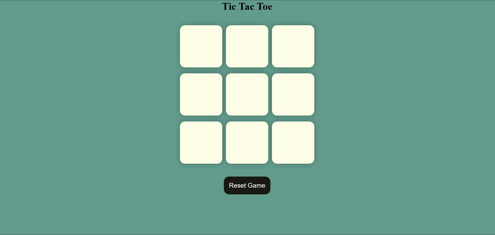

# Tic-Tac-Toe
# Tic Tac Toe Game 🎮

A fun and interactive Tic Tac Toe (X-O) game built using **HTML**, **CSS**, and **JavaScript**. This is a beginner-friendly project that helps understand DOM manipulation, event handling, and game logic.

---

## 🔥 Features

- Player vs Player Mode
- Turn-based logic with alternating X and O
- Displays a winner message or draw at the end of the game
- Reset and New Game options
- Responsive design
- Stylish UI using basic CSS

---

## 🛠 Technologies Used

- HTML5
- CSS
- JavaScript

---

## 📷 Screenshot

*(Make sure your screenshot is saved as `screenshot.png` in the root of your repository or update the name accordingly.)*

---

## 🚀 How to Play

1. Clone the repository or [Download ZIP](https://github.com/yourusername/tic-tac-toe-game/archive/refs/heads/main.zip)
2. Open `index.html` in your browser.
3. Click on the boxes to make your move.
4. "O" starts first by default.
5. If all 9 boxes are filled and no player wins, the game ends in a **draw**.
6. Use the **New Game** or **Reset** buttons to play again.

---

## 📁 Project Structure

